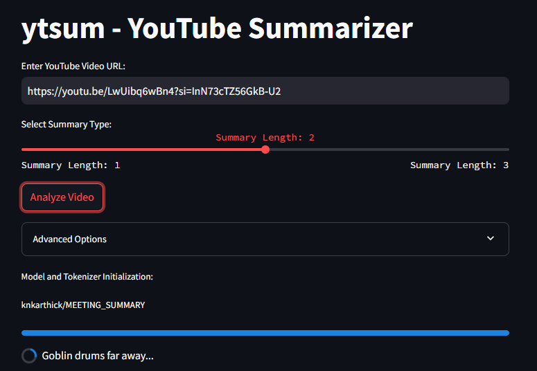
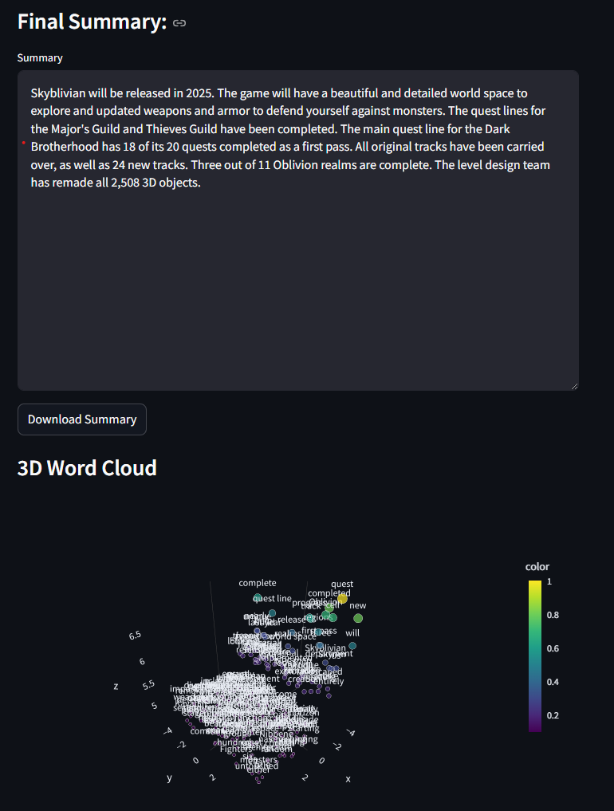

#   ytsum - YouTube Video AI Summarizer 🎥

`ytsum` is an AI-powered YouTube video summarization, local tool that extracts key information from YouTube videos, transcribes audio, generates summary, and provides an interactive wordcloud visualization.
## 📌 Features

- **Video Downloading**: Download YouTube videos in high quality.
- **Audio Extraction**: Extract audio from the downloaded videos.
- **Transcription**: Automatically transcribe video audio into text using Whisper.
- **Summarization**: Generate concise summaries using advanced AI models.
- **Word Cloud**: Generate a word cloud from the transcript to visualize important keywords.

## ⚙️ Limitation
Due to how YouTube handles cookies and remote access to video streams, the tool may not work properly on cloud environments or when the user is not logged in.

Although PlayWright has been added to create the necessary cookies, the headless application still fails on video download at the moment. 

This is a known issue with YouTube's cookie policy and remote access restrictions.

Best way to circumvent this issue, you can download the project and use locally as per >Usage< section below.

In case of local moviepy issues change the app.py import section:
>> deactivate import moviepy as mp
> 
>> activate import moviepy.editor as mp

and run again.

## ⚙️ Installation

### Requirements

- Python >= 3.7
- Required libraries: `streamlit`, `yt-dlp`, `whisper`, `transformers`, `pydub`, `moviepy`, `tqdm`, etc.

To install the necessary dependencies, run:

```bash
pip install -r requirements.txt
```

### Setup
```bash
git clone https://github.com/th3pajay/ytsum.git
cd ytsum
```

### Usage
```bash
streamlit run app.py
```
or start by specifying the exact path:
```bash
streamlit run C:\Users\user\PycharmProjects\ytsum\app.py 
```
Specify the youtube video you would like to summarize, and choose preferred detail level or additional model parameters.
Click on 'Analyze' to start the program.



Model (shoutout to knkarthick for the pre-trained model) 
will take all transcripted chunks and summarize them into a single summary with a wordcloud visualization.



## 🚀 Streamlit Demo
You can also use a live instance of `ytsum` on [Streamlit](https://streamlit.io/). (TO BE INVESTIGATED FURTHER)